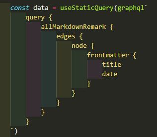
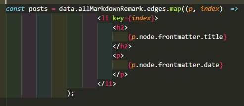

## How I rendered my array of blog posts!

Now that I have some blog posts created and the ability to pull and convert them via the necessary plugins I'm able to add the posts to the blog.

Using GraphQL Playground I laid out the necessary query to grab the date and title of each blog post.
 
To do this I created a const variable called data and using the 'graphql' and 'useStaticQuery' components, provided by Gatsby.
 
I wrote out the query using a template literal, pictured below.

This allowed me to pull the post title and date to render them in an ordered list on the main blog page.
 
Before I was able to display them I first had to map the data to be rendered for each item in the list.
 
For this I created another const variable called 'posts' to iterate over the 'edges' array in the query, used the map function to convert it to JSX and saved that under a parameter.
 
Using an arrow function I created an li for each post in the array, each li having a h2 tag for the title and a p tag for the date.
 
I used a key of 'index' for the li to help React identify each element, then I put the title and date to be rendered in their respective tags.

I was then able to render a list of posts by wrapping {posts} with an ordered list tag inside the blog page layout element.
