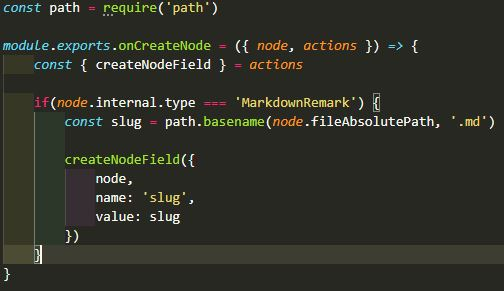
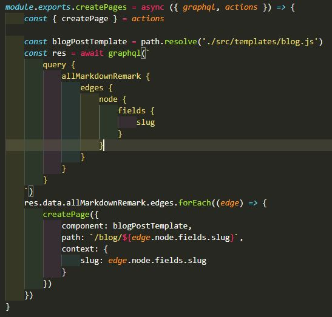
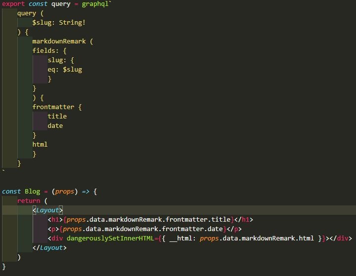

## How I rendered blog post pages!

To achieve rendering a page for each blog post I had to make use of the [Gatsby Node APIs](https://www.gatsbyjs.com/docs/node-apis/).

First I had to generate a 'slug' for each blog post which turned the post file name into a string and which can be added at the end of the site blog url.
 
I took the onCreateNode API (from Gatsby Node APIs) and added it to the gatsby-node.js file.
 
In the API configuration I set up an if statement to target nodes only when the node internal type is 'MarkdownRemark', which is the type for the blog posts.
 
Inside the if statement I added a console log to view each post object and utilised the JSON stringify method to convert the object into a JSON string to ease navigation.
 
I created a new const variable inside the if statement and using the path.basename method from Node Js, I then extracted the blog post slug from fileAboslutePath.
 
Then using createNodeField from the onCreateNode API I'm able to use the slug for each blog post.

In order to show each blog post I created a blog post template in the templates directory.

To generate a new page for each blog post I utilised the createPages API (from Gatsby Node APIs) which I added to gatsby-node.js.
 
Inside the API I created a blogPostTemplate const variable to target the template which I created.
 
Using the graphql method from the API, I made a query (which I got using GraphQL Playground) to grab the slug for each blog post.
 
I then used the forEach method to execute the createPages function for every element in the array I got from the query, specifying the component(blogPostTemplate), path and context.

Next I modified the query which I made on the blog page to also grab the slug and wrapped the blog title with the Gatsby Link component to access each blog post from the main blog page.
 
To use the post data on the blog template I had to create another query using graphql inside the blog template file.
 
Then I added a props property to the component and added the query data into their respective tags.

